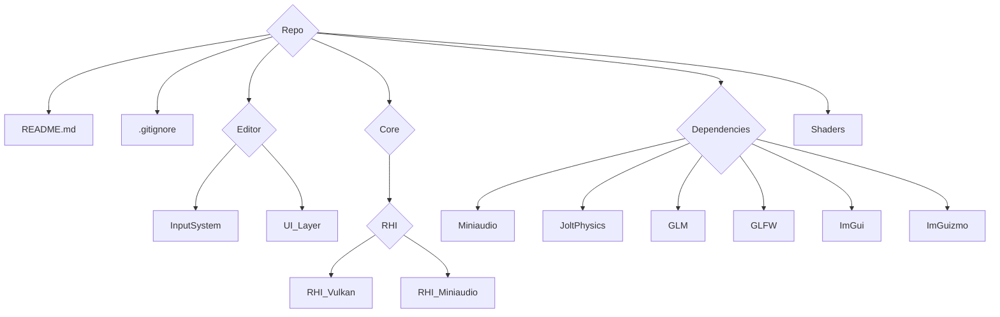
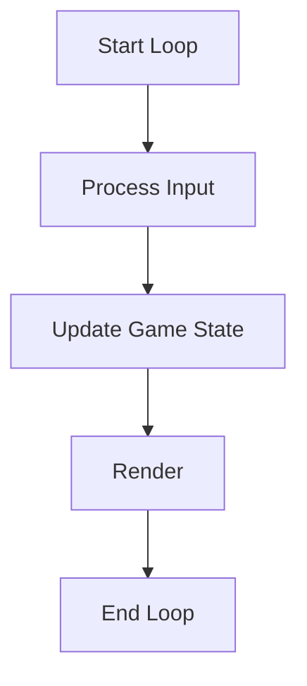

# Technical Design Document (TDD) for C++ MoteurVulkan

## Document Header
- **Project Title:** C++ MoteurVulkan
- **Version:** 1.0
- **Date:** 2026-02-03
---
## Authors
| Author           | Contact                 |
|------------------|-------------------------|
| Morgane Prevost  | mprevost@gaming.tech    |
| Dylan Hollemaert | dhollemaert@gaming.tech |
| Clément Bobeda   | cbobeda@gaming.tech     |
| Najim Bakkali    | nbakkali@gaming.tech    |
| Leo Grognet      | lgrognet@gaming.tech    |

## Revision History
| Date       | Version | Description                  | Author                                                         |
|------------|---------|------------------------------|----------------------------------------------------------------|
| 2026-02-03 | 1.1     | Document General improvement | [Leo Grognet, Clément BOBEDA, Dylan Hollemaert, Najim Bakkali] |
| 2026-02-03 | 1.0     | Initial document creation    | [Leo Grognet, Clément BOBEDA]                                  |

## Table of Contents
1. [Introduction](#1-introduction)
2. [System Overview](#2-system-overview)
3. [Requirements](#3-requirements)
4. [System Architecture & Design](#4-system-architecture--design)
5. [Detailed Module Design](#5-detailed-module-design)
6. [Interface Design](#6-interface-design)
7. [Performance and Optimization](#7-performance-and-optimization)
8. [Testing Strategy (TDD Implementation)](#8-testing-strategy-tdd-implementation)
9. [Tools, Environment, and Deployment](#9-tools-environment-and-deployment)
10. [Security and Safety Considerations](#10-security-and-safety-considerations)
11. [Project Timeline and Milestones](#11-project-timeline-and-milestones)
12. [Appendices](#12-appendices)

---

## 1. Introduction

### 1.1 Purpose
This document outlines the technical design for a modular C++ Game Engine, detailing its architecture, modules, and Test-Driven Development (TDD) approach.

### 1.2 Scope
- **Objective:** Develop a cross-platform, fast and intuitive game engine for rendering, physics, audio, and input management.
- **Application:** Real-time game development and academic projects.

### 1.3 Definitions, Acronyms, and Abbreviations
- **TDD:** Test-Driven Development
- **API:** Application Programming Interface
- **FPS:** Frames Per Second
- **IDE:** Integrated Development Environment
- **GUI:** Graphical User Interface
- **Gizmo:** Gizmo are directly manipulable, self-contained, visual screen idioms

### 1.4 References / Dependencies
- [C++ Standard Documentation](https://en.cppreference.com/)
- [Google Test Framework](https://github.com/google/googletest)
- [Mini audio for sound management](https://github.com/mackron/miniaudio)
- [Jolt physics for physics management](https://github.com/jrouwe/JoltPhysics)
- [GLM for mathematics](https://github.com/g-truc/glm)
- [GLFW for window handling](https://github.com/glfw/glfw)
- [ImGui for all GUI handling](https://github.com/ocornut/imgui/tree/docking)
- [ImGuizmo for the implementation of gizmo](https://github.com/CedricGuillemet/ImGuizmo)

### 1.5 Document Overview
This Technical Design Document (TDD) details the architecture of a high-performance, lightweight game engine specifically tailored for academic environments. The primary goal is to provide a robust yet accessible platform for game design students, balancing low-level technical transparency with high-level usability.
To fulfill these requirements, the engine’s design focuses on three core pillars:

- **Performance** & **Optimization**: Leveraging the Vulkan API through a custom RHI (Render Hardware Interface) to ensure a minimal memory footprint and high frame rates on varied hardware.

- **Educational Accessibility**: Abstracting the verbosity of modern graphics APIs into a clean, intuitive interface, allowing students to focus on game logic and scene composition rather than hardware-specific boilerplate.

- **Modular Decoupling**: A strict separation between the Editor (creation tool) and the Runtime (execution layer). This ensures that students can experiment in a stable environment where game-logic errors remain isolated from the core engine tools.

This document serves as the structural roadmap for implementation, covering module interactions, data flow, and the testing strategies necessary to maintain a stable learning tool.


---

## 2. System Overview

### 2.1 High-Level Description
The engine is built as a **layered modular system** using **C++20**. It is architected to decouple high-level game logic from low-level hardware interactions, ensuring both high performance and ease of use for academic purposes.

The system is organized into three primary layers:

1. **Application** & **Tools Layer**: The **Editor** and **Runtime** environments. The **Editor** provides a visual interface for scene composition, while the **Runtime** offers a lightweight execution path for the final game. Both communicate with the core through a unified API.

2. **Core Engine** : This layer acts as the "brain" of the engine. It manages the **Scene Graph** (object hierarchy) and dispatches tasks to specialized Servers (Rendering, Physics, Audio).

3. **Abstraction Layer (RHI & Drivers)**: To ensure long-term stability and performance, the engine utilizes a **Render Hardware Interface (RHI)**. This layer translates high-level draw calls into optimized Vulkan commands. This abstraction hides the complexity of **Vulkan** from the end-user while maintaining "close-to-metal" speed.


### 2.2 System Context Diagram



### 2.3 Major Components
- **Rendering Engine:** Handles graphics using the Vulkan API.
- **Physics Engine:** Manages collision detection and physics simulations using Jolt Physics.
- **Audio Engine:** Processes sound effects and music using miniaudio.
- **Input Manager:** Captures keyboard, mouse, and gamepad events using GLFW.
- **Window Manager:** Manages application window and dispatches events using GLFW 
- **Editor GUI:** Graphical user interface using ImGui
- **Game Logic:** Integrates modules via a scripting interface.

---

## 3. Requirements

### 3.1 Functional Requirements
- Render 3D graphics with dynamic lighting and shading.
- Perform real-time physics simulation and collision detection.
- Play background music and trigger sound effects.
- Capture and process user inputs.
- Provide a scripting interface for game behavior customization.

### 3.2 Non-Functional Requirements
- **Performance:** Maintain a minimum of 60 FPS.
- **Scalability:** Modular design for easy extension.
- **Portability:** Support Windows, Linux, and macOS.
- **Maintainability:** Clear code structure with thorough documentation.

### 3.3 Use Cases
- **Rendering:** Load and display complex scenes.
- **Physics:** Update object states and detect collisions.
- **Audio:** Manage and play audio assets.
- **Input:** Map user actions to game events.

### 3.4 Design Constraints and Assumptions
- Use modern C++ (C++20 or later).
- Use Slang as the primary shader language.
- Rely on hardware-accelerated graphics.
- Assume a minimum hardware configuration for target platforms.

---

## 4. System Architecture & Design

### 4.1 Architectural Overview
The engine employs a component-based architecture. Each module has well-defined interfaces, ensuring loose coupling and isolated development.

### 4.2 Module Breakdown
- **Rendering Module:** Handles shaders, textures, and communicates with the GPU.
- **Physics Module:** Implements collision detection and rigid body dynamics.
- **Audio Module:** Interfaces with audio libraries (mini audio).
- **Input Module:** Abstracts device-specific input.
- **Game Logic Module:** Manages scripting and event coordination.

### 4.3 Interaction Diagrams

#### Sequence Diagram: Rendering a Frame
```

User Input -> Game Logic -> Rendering Module -> GPU

```

#### Game Loop Flowchart


### 4.4 Design Decisions and Rationale
- **Language Choice:** C++ for high performance.
- **Modular Design:** Supports isolated testing and independent module development.
- **Graphic API:** Vulkan is a modern Graphic API and cross-platform allowing us to get the best performances.
- **TDD:** Ensures high code quality and early bug detection.

---

## 5. Detailed Module Design

### 5.1 Class Diagrams and Data Structures
- **Rendering:** `Renderer`, `Shader`, `Texture`
- **Physics:** `PhysicsEngine`, `Collider`, `RigidBody`
- **Audio:** `AudioEngine`, `Sound`, `MusicPlayer`
- **Input:** `InputManager`, `Controller`

### 5.2 Key Algorithms and Code Snippets

#### Basic Rendering Loop in C++
```cpp
#include <iostream>
#include "Renderer.h"

int main() {
    Renderer renderer;
    if (!renderer.initialize()) {
        std::cerr << "Renderer initialization failed." << std::endl;
        return -1;
    }
    
    while (renderer.isRunning()) {
        renderer.processInput();
        renderer.updateScene();
        renderer.renderFrame();
    }
    
    renderer.shutdown();
    return 0;
}
````

### 5.3 Error Handling and Logging

- Utilize exception handling for critical errors.
- Implement a logging system to record runtime events and performance metrics.

---

## 6. Interface Design

### 6.1 Internal Interfaces

- Define clear APIs between modules using abstract classes or interfaces.

### 6.2 External APIs and File Formats

- Support standard file formats: OBJ (models), PNG (textures), WAV (audio).
- Provide documentation for external scripting interfaces.

### 6.3 User Interface (if applicable)

- Develop a debug UI for real-time performance monitoring and diagnostics.

---

## 7. Performance and Optimization

### 7.1 Performance Goals

- Consistently achieve 60 FPS.
- Optimize memory usage and processing overhead.

### 7.2 Profiling and Benchmarking

- Integrate profiling tools such as Valgrind or Visual Studio Profiler.
- Include benchmarking tests as part of the TDD suite.

### 7.3 Optimization Techniques

- Use object pooling and memory management best practices.
- Implement batching and frustum culling in the rendering process.

---

## 8. Testing Strategy (TDD Implementation)

### 8.1 Overview of TDD

- Write tests before implementation to drive design decisions and ensure code reliability.

### 8.2 Unit Testing

- Develop tests for individual components.
- **Example using Google Test:**

```cpp
#include <gtest/gtest.h>
#include "Renderer.h"

TEST(RendererTest, InitializeSuccess) {
    Renderer renderer;
    EXPECT_TRUE(renderer.initialize());
}
```

### 8.3 Integration Testing

- Verify that modules interact correctly through integration tests.

### 8.4 Regression Testing

- Maintain a suite of automated tests to catch and fix regressions early.

### 8.5 Testing Tools and Frameworks

- **Framework:** Google Test
- **CI/CD:** Automate testing with CI pipelines (e.g., GitHub Actions).

---

## 9. Tools, Environment, and Deployment

### 9.1 Development Tools and IDEs

- Recommended IDEs: Visual Studio, CLion, or VSCode.
- Code editors that support C++17 features.

### 9.2 Build System and Automation

- Use CMake for project configuration.
- Automate builds using CI/CD pipelines.

### 9.3 Version Control

- Use Git for version control.
- Adopt a clear branching strategy for feature development.

### 9.4 Deployment Environment

- Target platforms: Windows, Linux, macOS.
- Provide deployment instructions and environment setup guides.

---

## 10. Security and Safety Considerations

- Validate all external input to avoid runtime vulnerabilities.
- Implement robust error handling.
- Perform regular code reviews and security audits.

---

## 11. Project Timeline and Milestones

- **Phase 1:** Requirement Analysis & Detailed Design
- **Phase 2:** Core Module Development (Rendering, Physics, Audio, Input)
- **Phase 3:** Integration and Testing
- **Phase 4:** Optimization and Final Deployment
- Outline milestones with deadlines and deliverables.

---

## 12. Appendices

### 12.1 Glossary

- **Game Engine:** The core framework managing all game processes.
- **Module:** A self-contained component providing specific functionality.
- **Shader:** A program executed on the GPU to control rendering.

### 12.2 Additional Diagrams

- Include any additional architectural diagrams or flowcharts as needed.

### 12.3 References and Further Reading

- Additional resources on C++ game development and engine architecture.
